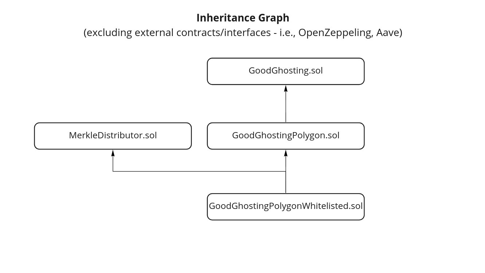

# GoodGhosting

The new addictive way to save. Our savings pools reward regular savers with higher interest rates. The more people drop out, the greater the returns for the winners!

How?
- The game is divided into segments. These can be weekly, monthly or any other duration.
- During the first segment, players can join the game by depositing a fixed amount of DAI (by calling `joinGame` (open games) or `joinWhitelistedGame` (closed games)).
- This DAI is transferred into the smart contract, which is then deposited into Aave where it accrues interest for the savings pool, receiving aDAI back into the contract.
- To stay in the game, players must deposit before the end of each segment (via `makeDeposit`), except the last segment which is considered a "waiting round".
- Players that missed a deposit, still get their principal back after the end of the game, but do not earn any interest.
- Users can withdraw their principal at any time, if they wish to do so (`earlyWithdraw`). Early withdrawal fees may apply.
- At the end of the game, the earned interest (and rewards, if applicable) is split amongst all players who made every deposit. Aka: the winners. All users can then withdraw their funds (`withdraw`).
- After the game ends, the admin can also withdraw the performance fees (`adminFeeWithdraw`), if applicable.

# Smart Contract Overview



* **[GoodGhosting](./contracts/GoodGhosting.sol)** is the base game contract where players can join the game, make regular deposits and win. This contract, implements an open game, where any user can join the pool. It is intended to be deployed to the **Ethereum Network**, using [Aave](https://aave.com/) pool as the interest generation strategy.

* **[GoodGhostingPolygon](./contracts/GoodGhostingPolygon.sol)** is an extension of the GoodGhosting contract compatible with [Polygon](https://polygon.technology/) to generate extra yield from the ongoing [Aave-Polygon Liquidity mining](https://cryptobriefing.com/polygon-launches-40m-liquidity-mining-program-with-aave/) program. Due to this program, this contract also handles (claims) the additional $MATIC rewards generated by the LP program, and distributes this additional rewards to the winners of the game, generating extra yield. This contract is intended to be deployed to the **Polygon Network**.

* **[GoodGhostingPolygonWhitelisted](./contracts/GoodGhostingPolygonWhitelisted.sol)** is an extension of `GoodGhostingPolygon` and [MerkleDistributor](./contracts/MerkleDistributor.sol) and uses a merkle proof verifying logic to restrict the users that can join the game (closed game). So in order for a player to join the game, the player needs to be verified based on proof and merkle root deployed with this contract.

* **[MerkleDistributor.sol](./contracts/MerkleDistributor.sol)**: Implements a merkle proof verification used for whitelisting purposes.

### Exploratory Contracts (not-ready)
* **[GoodGhostingCelo](https://github.com/Good-Ghosting/goodghosting-smart-contracts/blob/feature/celo/contracts/GoodGhostingCelo.sol)** is a **non-production ready** implementation of GoodGhosting contract, that uses batched transfers, compatible with [Celo](https://celo.org/) network and uses [Moola](https://moola.market/) to generate extra yield for the winners.

* **[GoodGhosting_Polygon_Quickswap](./contracts/GoodGhosting_Polygon_Quickswap.sol)** is a **non-production ready** implementation of GoodGhosting, that uses batched transfers, compatible with Polygon network and uses QuickSwap as a strategy to generate interest for players by staking tokens into the available LP pools.
# Development

## Development Recommendations

- Try to use well-known patterns and best practices when possible. They help us to decrease the likelihood of introducing vulnerabilities in the code.
- Try to use declarative names for functions and variables. They increase code readability and maintainability
- Try to keep test coverage as close as possible to 100%. It helps to make sure the contract does what is supposed to do, according to project specs.
- Try not to only think about how to make the code work so it meets the project specifications. But, also think about how to break it, how to try to use "out-of-scope" scenarios to exploit the contract's functionality (think as the bad guy). Examples: invalid inputs, calls to functions out of sequence (when they were supposed to follow a specific sequence of calls defined by the state machine), external contract interactions, etc.
- Try to use security tools (i.e., Slither, MythX, etc.) as part of the development process to help to identify well-known / documented issues. Security should be part of the development routine, and not something to be postponed prior to deploying the contract(s) on mainnet. Exploits, bugs and unknown vulnerable scenarios may happen, but we should make our best effort to have in place a development process that considers security on a daily-basis and fully embracing it while developing.

## Setup

Install Truffle.
```bash
npm install -g truffle
```

Install Ganache for having a local dev Ethereum network.
```bash
npm install -g ganache ganache-cli
```

Create a local `.env` file by copying the sample `.env.sample` file available in the root folder (`cp .env.sample .env`). After your `.env` file is created, edit it with appropriate values for the variables.


## Common Development Commands

Compile contracts
```bash
truffle compile
```

Start dev env in one terminal
```bash
truffle develop
```


## Maintaining Packages Updated

To check for new packages, install [npm-check-updates](https://www.npmjs.com/package/npm-check-updates): `npm install -g npm-check-updates`.

To check for updates for `ncu`
To check and update `package.json` file, run `ncu -u`. Once completed, make sure to run `npm install` to update all the packages.


# Tests

## Unit Tests

**Requirement:** The tests use the file `deploy.config.js` as input to the contract migration. Make sure it is configured.

For the current contract version we have whitelisted players with help of merkle root verification on-chain, so the joinGame method takes in player index and merkle proofs hence check the instructions [here](https://github.com/Good-Ghosting/goodghosting-smart-contracts/blob/master/test/GoodGhosting.test.js#L8) before the next step.

To run the unit tests use either
`truffle test`
or
`npm run test`

To run test coverage: `npm run coverage` or `truffle run coverage`

Note: If by some reason, like using truffle debugger, you need to execute a local ganache instance (instead of using the default one spined up by `truffle test`, you'll need to start ganache with the default mnemonic used for whitelisting purposes. In order to do that, start your `ganache-cli` as: `ganache-cli -m "clutchaptain shoe salt awake harvest setup primary inmate ugly among become"`. Now, just change your `truffle-config.js` to have a `development` network, and truffle will use your `ganache-cli` instance).

## Integration Tests Using Forked Networks (Mainnet Fork)
### Setup
To run the integrated test scenarios forking from Mainnet (Ethereum or Polygon) you'll have to:
- Configure `DAI_ACCOUNT_HOLDER_FORKED_NETWORK` in your `.env` file with an externally owned account (not smart contract) that holds enough DAI and ADAI balance on the forked network.

- Review the deployment configs ([deploy-config.js file](./deploy-config.js)) prior to executing the test on the forked network. Make sure that the `segmentPayment` and `segmentCount` are appropriately configured.

### Balance Requirements
- The `DAI_ACCOUNT_HOLDER_FORKED_NETWORK` transfers to the players the necessary funds to play the game, so this account needs to have enough balance. Most of the games are played with 5 players. So if `segmentPayment` is `1` and `segmentCount` is `4`, the account `DAI_ACCOUNT_HOLDER_FORKED_NETWORK` must have at least `21 DAI` available in the account: `(players (5) * segmentPayment(1) * segmentCount(4)) + segmentPayment` - the additional `segmentPayment` is needed because there's a scenario where the player rejoins the game, needing extra funds to cover the `earlyWithdrawalFee` charged by the contract.
- The `DAI_ACCOUNT_HOLDER_FORKED_NETWORK` sends extra AToken to simulate external incentive added to the pool. The amount sent as incentive is equal to `segmentPayment * segmentCount`. So, if `segmentPayment` is `1` and `segmentCount` is `4`, `DAI_ACCOUNT_HOLDER_FORKED_NETWORK` must have a balance of at least `4 aDAI` tokens.

### Steps

#### Ethereum Mainnet
On Ethereum Mainnet, the account `0x4a75f0ae51a5d616ada4db52be140d89302aaf78` had both assets at the time of writing, so this account is a good candidate to be used. To find another one, go to the DAI Token explorer (https://ethplorer.io/ or https://etherscan.io/) and get one of the top holders.

- On a terminal window, execute `ganache-cli` forking from mainnet. For details, check this [article](https://ethereumdev.io/testing-your-smart-contract-with-existing-protocols-ganache-fork/). Make sure to pass the address defined in the `.env` file in the `--unlock` parameter. The full command should look something like this:

  `ganache-cli -f https://cloudflare-eth.com/  -m "clutchaptain shoe salt awake harvest setup primary inmate ugly among become" -i 999 --unlock {DAI_ACCOUNT_HOLDER_FORKED_NETWORK}`

  or

  `ganache-cli -f https://mainnet.infura.io/v3/{YOUR_INFURA_PROJECT_ID} -m "clutchaptain shoe salt awake harvest setup primary inmate ugly among become" -i 999 --unlock {DAI_ACCOUNT_HOLDER_FORKED_NETWORK}`

- On another terminal window (from the root of the project directory), run `truffle test --network local-mainnet-fork` or `npm run test:fork:mainnet`


#### Polygon
On Polygon Vigil, the process is similar to Ethereum Mainnet described above, but the commands are slightly different:

- On a terminal window, execute `ganache-cli` forking from mainnet. For details, check this [article](https://ethereumdev.io/testing-your-smart-contract-with-existing-protocols-ganache-fork/). Make sure to pass the address defined in the `.env` file in the `--unlock` parameter. The full command should look something like this:
  `ganache-cli -f https://matic-mainnet-archive-rpc.bwarelabs.com -m "clutchaptain shoe salt awake harvest setup primary inmate ugly among become" -i 999 --unlock {DAI_ACCOUNT_HOLDER_FORKED_NETWORK}`

  or

  `ganache-cli -f https://rpc-mainnet.maticvigil.com/v1/{YOUR_POLYGON_PROJECT_ID} -m "clutchaptain shoe salt awake harvest setup primary inmate ugly among become" -i 999 --unlock {DAI_ACCOUNT_HOLDER_FORKED_NETWORK}`

- On another terminal window (from the root of the project directory), run `truffle test --network local-polygon-vigil-fork` or `npm run test:fork:polygon:vigil`

- For running the whitelisted contract tests, On another terminal window (from the root of the project directory), run `truffle test --network local-polygon-whitelisted-vigil-fork` or `npm run test:fork:polygon-whitelisted:vigil`

#### Celo
On Celo Mainnet, the account `0xEd936bc60AF587DdD1Ab93728e7164cC288FdE82` had both assets at the time of writing, so this account is a good candidate to be used.
You can find other accounts on celo block explorer.

- On a terminal window, execute `ganache-cli` forking from mainnet. The full command should look something like this:

  `ganache-cli -f https://forno.celo.org/  -m "clutchaptain shoe salt awake harvest setup primary inmate ugly among become" -i 999 --unlock 0xEd936bc60AF587DdD1Ab93728e7164cC288FdE82`


- On another terminal window (from the root of the project directory), run `truffle test --network local-celo-fork` or `npm run test:fork:celo`

# Security Tools
There's a few automated security tools that could be integrated with the development process. Currently, we use [Slither](https://github.com/crytic/slither) to help identify well-known issues via static analysis. Other tools may be added in the near future as part of the continuous improvement process.

## Slither
Make sure you install Slither by following the instructions available on [Slither's](https://github.com/crytic/slither) github page. Note: it requires Python, so you may need to install it before you're able to use Slither.

Slither can be executed with the following command:

```bash
slither contracts/GoodGhosting.sol --filter-paths "openzeppelin|aave"
```
This commands executes Slither and analyses the file `contracts/GoodGhosting.sol`, ignoring dependency contracts related to "openzeppelin" and "aave".

Currently, the most common used command for Slither in the repo is provided below. This command ignores all mock and non-production ready contracts.

```bash
slither . --filter-path "aave|Migrations.sol|batched|merkle|mock|moola|quickswap|utils|GoodGhosting_Polygon_Quickswap.sol|GoodGhostingCelo.sol|openzeppelin"
```


**Note:** You may get an error from Slither mentioning an imported file wasn't found. Example:
```bash
Error: Source "@openzeppelin/contracts/access/Ownable.sol" not found: File not found.
 --> contracts/GoodGhosting.sol:5:1:
  |
5 | import "@openzeppelin/contracts/access/Ownable.sol";
```

This happens because Slither can't resolve the `import` in the contract to the `node_modules` folder.
Using the results from the example above, the `import` command `import "@openzeppelin/contracts/access/Ownable.sol";` should be replaced by `import "node_modules/@openzeppelin/contracts/access/Ownable.sol";`. **PLEASE DO NOT COMMIT THIS CHANGE**. It is only applicable when running Slither.


# Contract Deployment
The project uses [Infura](https://infura.io/) to deploy smart contracts to Ethereum networks (testnets and mainnet). What you'll need:
- SignIn/SignUp at Infura, create a project and get the project id.
- Your wallet mnemonic (12 words seed).

The project uses [Matic RPC](https://rpc.maticvigil.com/) to deploy smart contracts to POlygon networks (testnets and mainnet). What you'll need:
- SignIn/SignUp at Matic RPC, create a project and get the project id.
- Your wallet mnemonic (12 words seed).


**Setup**
1. Copy [.env.sample](./.env.sample) as an `.env` file. You can run this command in your terminal: `cp .env.sample .env`
2. Open file `.env`
3. Insert your Infura or Polygon's ProjectId and your wallet mnemonic in the file for the desired network.
    - Note: If deploying to Celo networks (mainnet or testnets), add your private key in the appropriate config key with ```0x``` at the beginning
    - For Celo deployments going forward update the rpc based on your deployment at line 5 of truffle config for testnet, rpc = https://alfajores-forno.celo-testnet.org & for mainnet the rpc = https://forno.celo.org/
4. Open the file [deploy.config.js](./deploy.config.js) and set the desired deployment configs for the contract.
5. Once you have the `.env` and `deploy.config.js` files properly setup, you can deploy the GoodGhosting contract to the desired network by choosing one of the 02 options:
    - Deployment with manual contract verification: used for verifying contracts on block explorers like [Etherscan](https://etherscan.io), [MaticVigil Block Explorer](https://explorer-mainnet.maticvigil.com/), [Celo Block Explorer](https://explorer.celo.org/) (including their testnets block explorers)
    - Deployment with automatic contract verification on [sourcify.dev](https://sourcify.dev): used for verifying contracts with [sourcify.dev](https://sourcify.dev), where contracts' source code and metadata are stored on [IPFS](https://ipfs.io/)

In either method, in case you experience a deployment error similar to
```sh
Error: PollingBlockTracker - encountered an error while attempting to update latest block:
Error: ESOCKETTIMEDOUT
```
try switching the INFURA (or Polygon) url from `https` to `wss` and increasing the configs `networkCheckTimeout` and/or `timeoutBlocks` in [truffle-config.js](./truffle-config.js). See more details in this [issue thread](https://github.com/trufflesuite/truffle/issues/3356).


## Deploying Whitelisted Contracts that Require Merkle Root Generation
To deploy the `GoodGhostingPolygonWhitelisted` contract, a merkle root is required, introduced for the purpose of whitelisting users. The merkle root can be created by using the repo below:

Clone this [repository](https://github.com/Good-Ghosting/Whitelisting)

Install Dependencies: `yarn install`

Edit this [file](https://github.com/Good-Ghosting/Whitelisting/blob/master/scripts/example.json) with the addresses you want to whitelist, keeping the JSON format same.

Run: `yarn generate-merkle-root:example`

You should see an output similar to this:

`{"merkleRoot":"0x40867aa687de5ac616962b562ed033e36f9002c696ae408b9144e9f425ab166e","claims":{"0x49456a22bbED4Ae63d2Ec45085c139E6E1879A17":{"index":0,"exists":true,"proof":["0xc0afcf89a6f3a0adc4f9753a170e9be8a76083ff27004c10b5fb55db34079324"]},"0x4e7F88e38A05fFed54E0bE6d614C48138cE605Cf":{"index":1,"exists":true,"proof":["0x6ecff5307e97b4034a59a6888301eaf1e5fdcc399163a89f6e886d1ed4a6614f"]}}}`

Copy the value of the `merkleroot` field, and replace the merkle root parameter in the [deploy.config.js](./deploy.config.js) file. Once this step is done, the contract can be deployed using the deployment instructions provided above.


## Deploying Contracts and Manually Verifying on Block Explorers
These are the commands that can be used to deploy (deployment ONLY) the contracts to the appropriate network:
- Deploy to kovan: `npm run deploy:kovan`
- Deploy to ropsten: `npm run deploy:ropsten`
- Deploy to mainnet (PRODUCTION): `npm run deploy:mainnet`
- Deploy to polygon (PRODUCTION): `npm run deploy:polygon`
- Deploy to polygon the whitelisted contract (PRODUCTION): `npm run deploy:polygon-whitelisted`
- Deploy to Celo Alfajores testnet: `npm run deploy:alfajores`
- Deploy to Celo Mainnet: `npm run deploy:celo`

If the deployment is successful, you should see a deployment log in the terminal window similar to this:

```
Starting migrations...
======================
> Network name:    'kovan'
> Network id:      42
> Block gas limit: 12500000 (0xbebc20)


2_deploy_contracts.js
=====================

   Replacing 'SafeMath'
   --------------------
   > transaction hash:    0x0f400b0dc0fcd29c943271f2823d3922db14aa3a7baa8e17295d15b6c1d442b6
   > Blocks: 0            Seconds: 0
   > contract address:    0x66FF9E7d6Dca966eB6798079Fec3D482179cdDC8
   > block number:        22436472
   > block timestamp:     1607159132
   > account:             0x826a471055333505E596F424348983aF0Aa8411B
   > balance:             192.247194179
   > gas used:            71933 (0x118fd)
   > gas price:           20 gwei
   > value sent:          0 ETH
   > total cost:          0.00143866 ETH

   Pausing for 2 confirmations...
   ------------------------------
   > confirmation number: 1 (block: 22436473)
   > confirmation number: 2 (block: 22436474)

   Replacing 'GoodGhosting'
   ------------------------
   > transaction hash:    0xaded2b2130afff3c62ec96dc67e7fc63dbf830edc4c551746c72566c8f6e15ce
   > Blocks: 0            Seconds: 0
   > contract address:    0x1180d93c188874F1BE03702c259fb53a88605EC7
   > block number:        22436475
   > block timestamp:     1607159152
   > account:             0x826a471055333505E596F424348983aF0Aa8411B
   > balance:             192.192982659
   > gas used:            2710576 (0x295c30)
   > gas price:           20 gwei
   > value sent:          0 ETH
   > total cost:          0.05421152 ETH

   Pausing for 2 confirmations...
   ------------------------------
   > confirmation number: 1 (block: 22436476)
   > confirmation number: 2 (block: 22436477)


----------------------------------------------------
GoogGhosting deployed with the following parameters:
----------------------------------------------------

Network Name: kovan
Lending Pool: aave
Lending Pool Address Provider: 0x506B0B2CF20FAA8f38a4E2B524EE43e1f4458Cc5
Inbound Currency: dai at 0xFf795577d9AC8bD7D90Ee22b6C1703490b6512FD
Segment Count: 6
Segment Length: 180 seconds
Segment Payment: 10 dai (10000000000000000000 wei)
Early Withdrawal Fee: 10%


ABI-Encoded Constructor Parameters:
000000000000000000000000ff795577d9ac8bd7d90ee22b6c1703490b6512fd000000000000000000000000506b0b2cf20faa8f38a4e2b524ee43e1f4458cc5000000000000000000000000000000000000000000000000000000000000000600000000000000000000000000000000000000000000000000000000000000b40000000000000000000000000000000000000000000000008ac7230489e80000000000000000000000000000000000000000000000000000000000000000000a


   > Saving artifacts
   -------------------------------------
   > Total cost:          0.05565018 ETH


Summary
=======
> Total deployments:   2
> Final cost:          0.05565018 ETH
```

### Manually Verifying Contracts on Block Explorers
#### Etherscan and Polygon Matic
Use the following steps to verify the contract on Etherscan or Polygon Matic:

1. Flatten the GoogGhosting contract. If using VSCode, you can use the extension (Solidity Contract Flattener)[https://marketplace.visualstudio.com/items?itemName=tintinweb.vscode-solidity-flattener]
2. In the new flattened file, delete all references to "// SPDX-License-Identifier: MIT". Tip: Use the "find and replace" option on your code editor, by finding by the value "// SPDX-License-Identifier: MIT" and replacing by an empty string (empty value in the "replace" field)
3. Access the deployed contract address on the block explorer. Make sure to use the appropriate Etherscan version that matches the network where the contract is deployed to (mainnet or testnets)
    1. The address of the deployed contract is available in the deployment log, displayed in the terminal window
4. Access the option to "Verify and Publish" the contract on the block explorer and enter the required parameters as below:
    1. *Contract Address*: get the address of the deployed contract from the deployment log, displayed in the terminal window
    2. *Compiler Type*: Select the option "Solidity (Single File)"
    3. *Compiler Version*: Check the version used by the repo on [truffle-config file](./truffle-config.js). Select the same config
    4. *Open Source License*: Choose the license. Use "No licence (None)" if not sure about which one to use
    5. *Optimization*: Check if optimization is used by the repo on (truffle-config file)[./truffle-config.js]. Select the same config
    6. *Solidity Contract Code*: Copy/Paste the code from the flattened file (after executing steps 1 and 2 above).
    7. *Constructor Arguments ABI-Encoded*: Copy/Paste the Constructor Arguments ABI-Encoded available in the deployment log, displayed in the terminal window
    8. *Misc Settings*: Make sure the configs available here, specially _Runs (Optimizer)_ is the same as the configs set in the [truffle-config file]()./truffle-config.js).


## Deploying Contracts to Mainnets/Testnets and Automatically Verifying Contracts on [sourcify.dev](https://sourcify.dev)

These are the commands that can be used to deploy and automatically verify the contracts on the appropriate network using [sourcify.dev](https://sourcify.dev):
- Deploy and Verify on kovan: `npm run deploy:verify:kovan`
- Deploy and Verify on ropsten: `npm run deploy:verify:ropsten`
- Deploy and Verify on mainnet (PRODUCTION): `npm run deploy:verify:mainnet`
- Deploy and Verify on polygon (PRODUCTION): `npm run deploy:verify:polygon`
- Deploy and Verify on polygon the whitelisted contract (PRODUCTION): `npm run deploy:verify:polygon-whitelisted`
- Deploy and Verify on Celo Alfajores testnet: `npm run deploy:verify:alfajores`
- - Deploy and Verify on Celo Mainnet: `npm run deploy:verify:celo`

If the verification and deployment is successful, you should see a deployment log in the terminal window similar to the sample below. Note that, for simplicity, the sample below "hides" a bunch of the logs displayed in the terminal window:

```sh
> truffle compile --all && npm run ipfs && truffle deploy -f 2 --network kovan --reset


Compiling your contracts...
===========================
> Compiling ./contracts/GoodGhosting.sol

...

> Compiled successfully using:
   - solc: 0.6.11+commit.5ef660b1.Emscripten.clang


> goodghosting-smart-contracts@1.0.0 ipfs
> node --no-warnings ./scripts/ipfs.js

Uploading sources & metadata to IPFS (Infura Gateway)...
========================================================

...

GoodGhosting
------------
metadata: QmW9k2sQ9iKX2xEkkQqG7Wk2rb75W7rcDVdi6A6wW4gAJa
source: QmP6dgQnF16wcw5vrC5V4WrQo5Hx73ac5gZMuay1Bn29fK

...

Finished.

...

Starting migrations...
======================
> Network name:    'kovan'
> Network id:      42
> Block gas limit: 12499988 (0xbebc14)


2_deploy_contracts.js
=====================

   Replacing 'SafeMath'
   --------------------

   ...

   Replacing 'GoodGhosting'
   ------------------------

   ...


----------------------------------------------------
GoogGhosting deployed with the following arguments:
----------------------------------------------------

Network Name: kovan
Lending Pool: aave
Lending Pool Address Provider: 0x88757f2f99175387ab4c6a4b3067c77a695b0349
Inbound Currency: dai at 0xFf795577d9AC8bD7D90Ee22b6C1703490b6512FD
Segment Count: 3
Segment Length: 86400 seconds
Segment Payment: 1 dai (1000000000000000000 wei)
Early Withdrawal Fee: 1%
Custom Pool Fee: 0%
Data Provider/Lending Pool Address: 0x3c73a5e5785cac854d468f727c606c07488a29d6
Merkle Root: 0x5abc53e710e8b8803671e65139073bd91d4c96f8d3cd2b9e8fbee9423ce964be


Constructor Arguments ABI-Encoded:
000000000000000000000000ff795577d9ac8bd7d90ee22b6c1703490b6512fd00000000000000000000000088757f2f99175387ab4c6a4b3067c77a695b0349000000000000000000000000000000000000000000000000000000000000000300000000000000000000000000000000000000000000000000000000000151800000000000000000000000000000000000000000000000000de0b6b3a7640000000000000000000000000000000000000000000000000000000000000000000100000000000000000000000000000000000000000000000000000000000000000000000000000000000000003c73a5e5785cac854d468f727c606c07488a29d65abc53e710e8b8803671e65139073bd91d4c96f8d3cd2b9e8fbee9423ce964be


   > Saving artifacts
   -------------------------------------
   > Total cost:          0.05464962 ETH


Summary
=======
> Total deployments:   2
> Final cost:          0.05464962 ETH
```
